# MIDTERM JAVA WITH SPRINGCOMMERCE PROJECT
## ERD
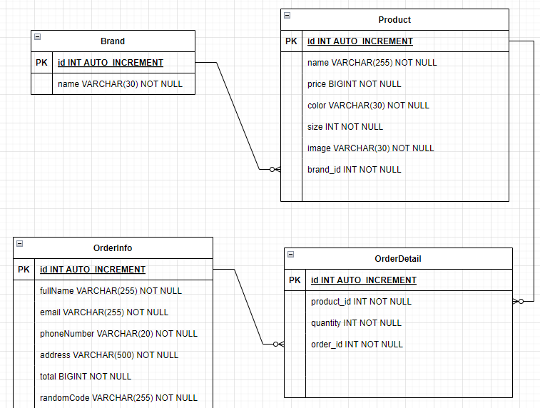

## Các công nghệ sử dụng
- MySQL: Quản lí database
- Thymleaf: Định dạng mẫu (template) HTML/XML được sử dụng để xây dựng các ứng dụng web Java.
- Lombok: Giảm thiểu lượng mã lặp đi lặp lại bằng cách tạo ra các phương thức getter, setter, constructor tự động từ các annotation được định nghĩa trong lớp Java
- Hibernate: Ánh xạ các đối tượng Java thành các bảng trong cơ sở dữ liệu.
- Spring boot web: Dễ dàng phát triển web bằng mô hình MVC

## Giải thích cấu trúc thư mục
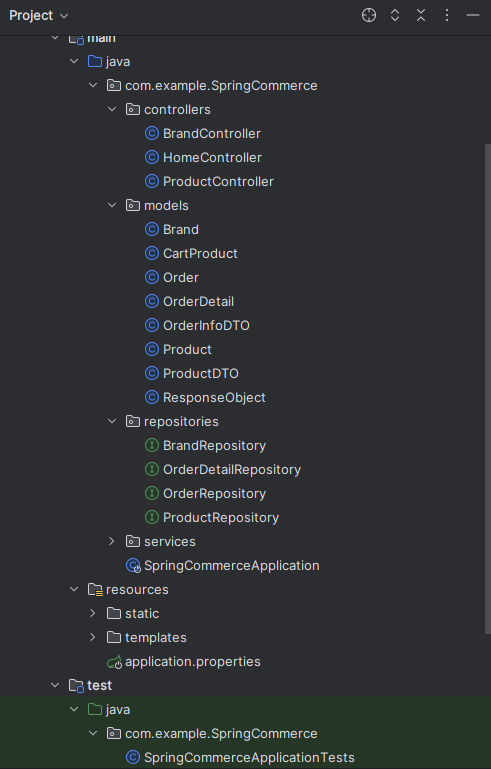
1. Controllers: Chứa các controller
- File BrandController.java có nhiệm vụ nhận và trả giá trị API của Brand
- File ProductController.java có nhiệm vụ nhận và trả giá trị API của Product
- File HomeController.java dùng để render và thực hiện các thao tác trên trang web
2. Models: chứa các đối tượng trong Hibernate và những đối tượng khác được tạo ra
- Brand, Order, OrderDetail, Product là các bảng trong Database được sử dụng thông qua Hibernate
- OrderInfoDTO, ProductDTO là 2 đối tượng được tạo ra để không đụng các thuộc tính trong database
- ResponseObject là đối tượng trả về giá trị cho API
3. Repositories: chứa các Interface được kế thừa JPARepository để dùng những hàm tương tác với database
4. Services: là tầng để Controller và Repository tương tác với nhau
- Resource:
  + Static: chứa các file css, js, image và imageproduct
  + Template: chứa các file html thymleaf

## Các bước để chạy ứng dụng:
- Bước 1: Set up Java Development Kit (JDK) và Maven tool trên thiết bị
- Bước 2: Clone source code từ Github
- Bước 3: Run Xampp và chọn Start đối với Apache và MySQL
- Bước 4: Click Admin tại MySQL trong Xampp, sau đó nhập midterm tại tùy chọn "Tạo cơ sở dữ liệu" để tiến hành tự động khởi tạo các bảng của database
- Bước 5: Run file SpringCommerceApplication để khởi tạo web, truy cập vào localhost với port 8081 và thực hiện các thao tác với web

## Home Page
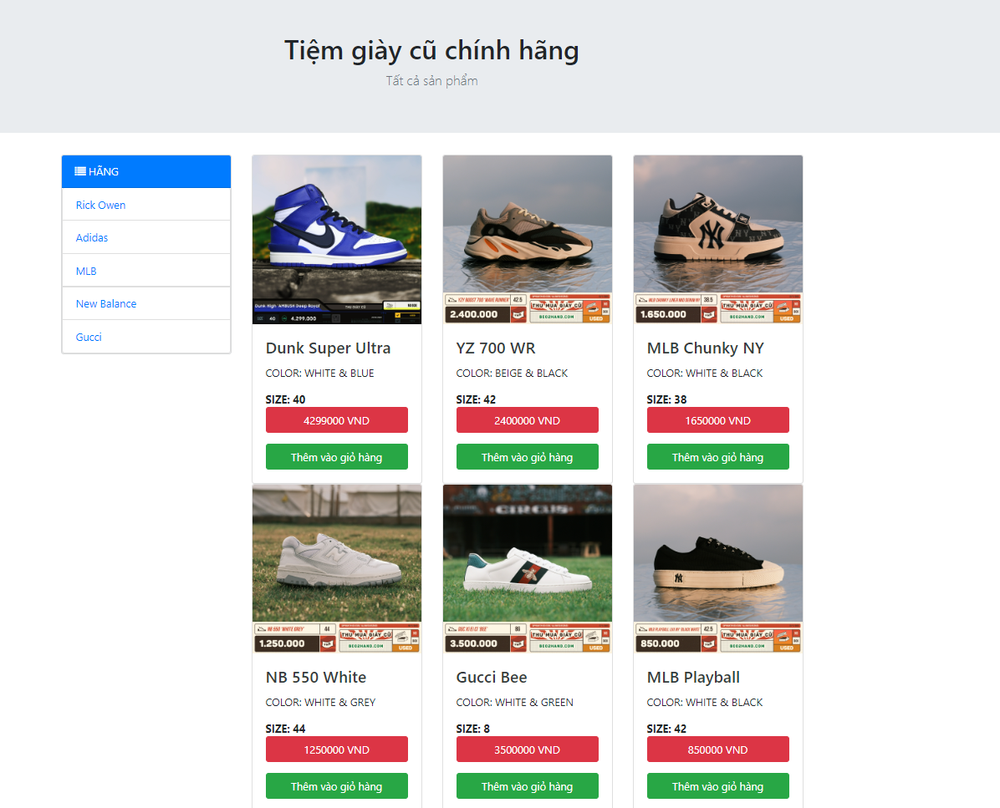

## API
### BRAND API
- Insert brand
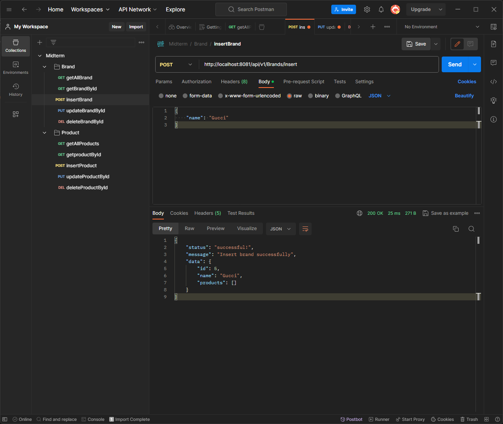
  + Thêm brand mới

- Get all brand
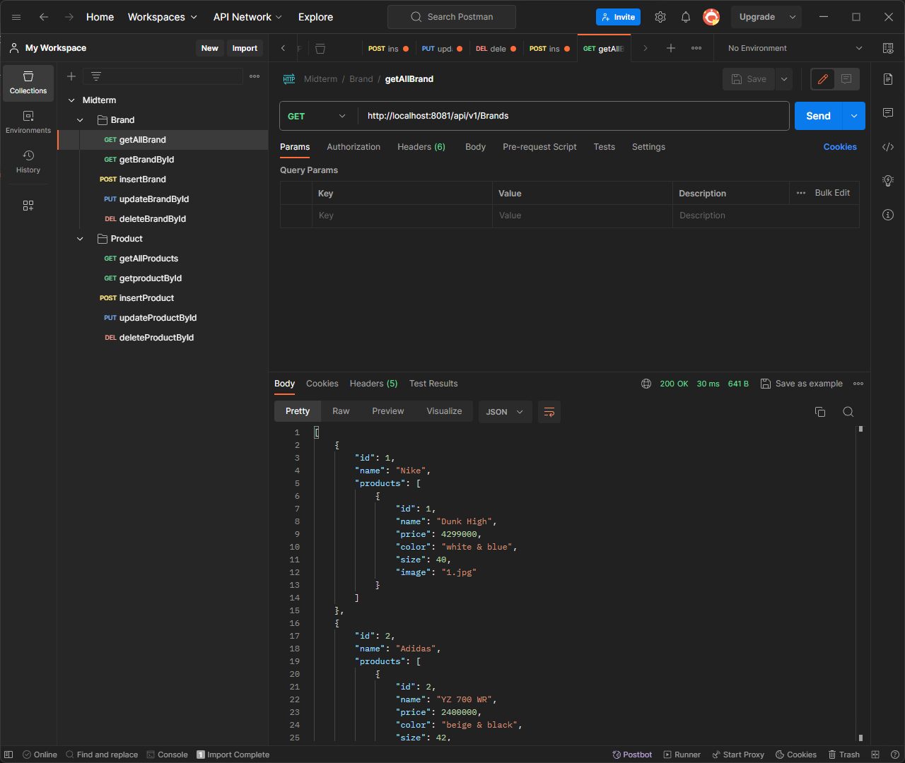
  + Show tất cả các brand đã được insert

- Get brand by id
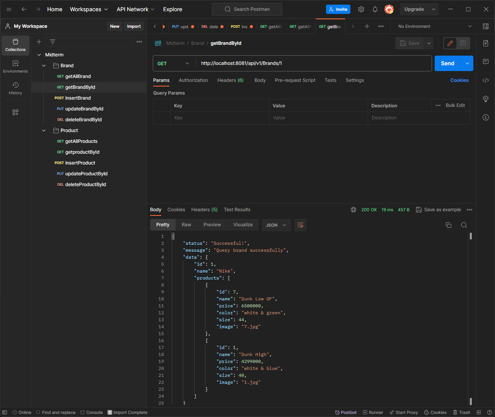
  + Show brand theo id được nhập

- Update brand by id
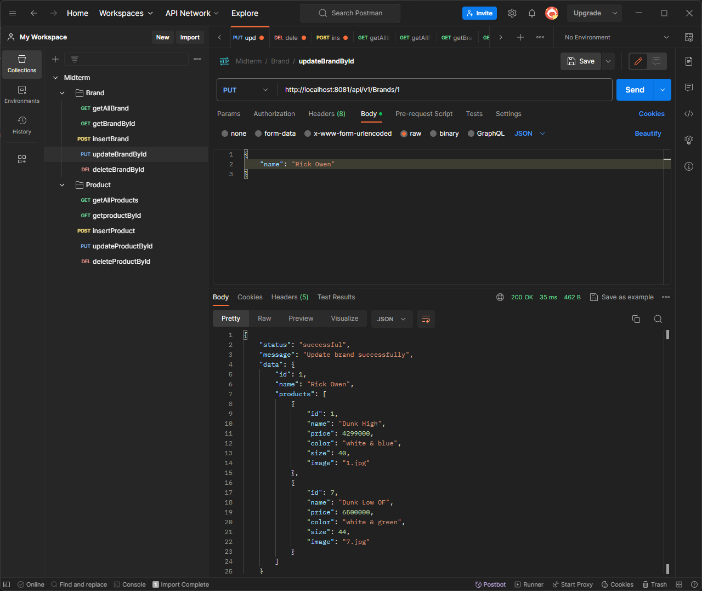
  + Đổi tên brand theo id được nhập từ Nike thành Rick Owen

- Delete brand by id
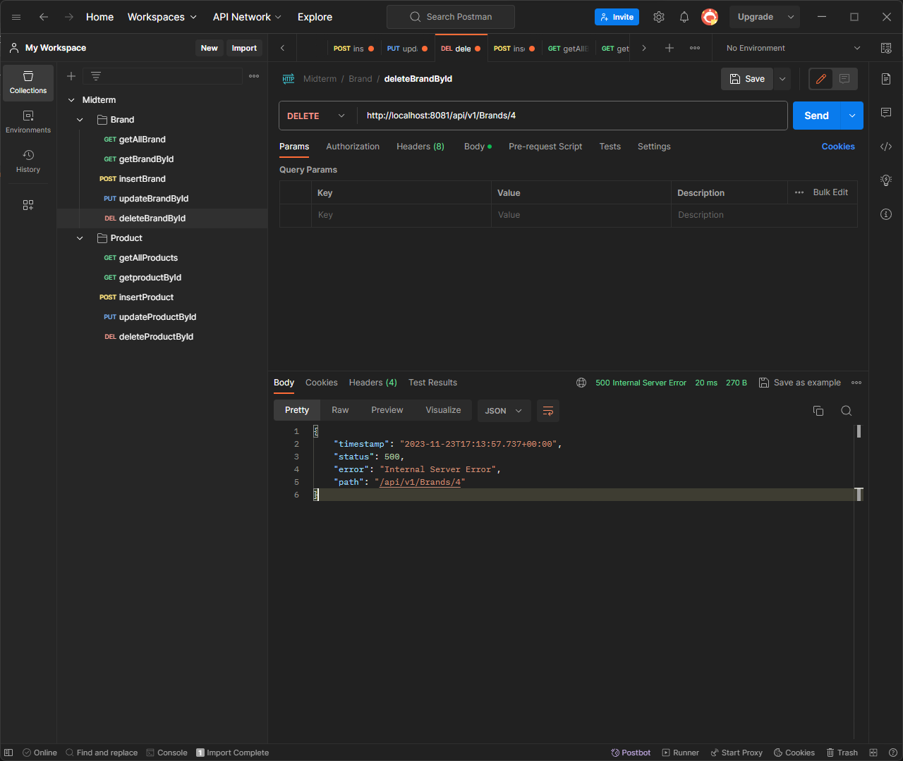
  + Xóa brand theo id được nhập

### PRODUCT API
- Insert product
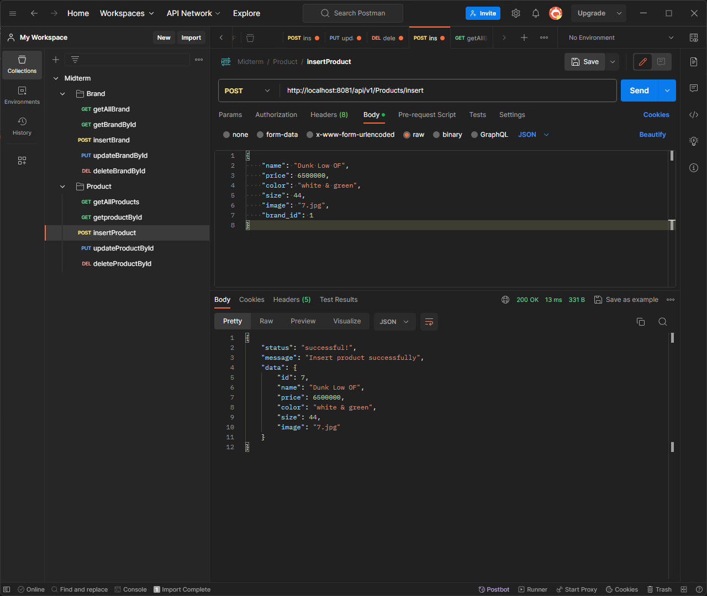
  + Thêm sản phẩm mới

- Get all products
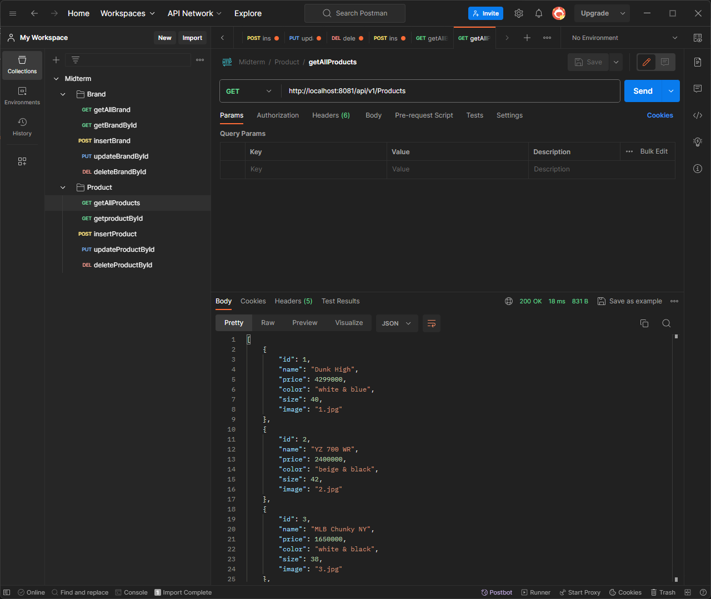
  + Show tất cả sản phẩm đã được insert

- Get product by id

  + Show sản phẩm theo id được nhập

- Update product by id

  + Đổi tên sản phẩm theo id được nhập từ Dunk High thành Dunk Super Ultra

- Delete product by id
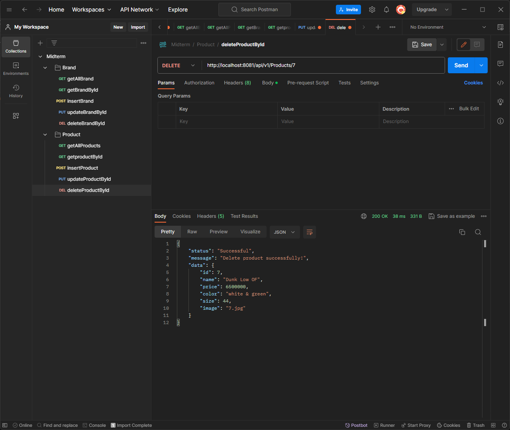
  + Xóa sản phẩm theo id được nhập